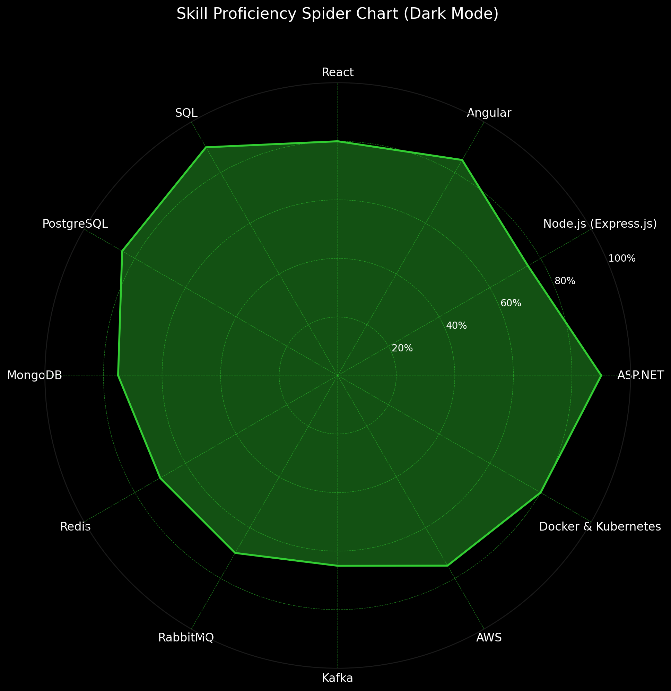

# Hi, I'm Hoang Tien Dung! 👋

## Summary

- 🎓 **Education**: Graduated in Software Engineering from Industrial University of Ho Chi Minh City (IUH), GPA: 3.2/4.
- 💼 **Current Role**: Full-Stack Developer at FPT Software with over 3 years of professional experience.
- 🌟 **Objective**: Eager to become an expert back-end developer, driving innovation and technological transformation.
- 🏆 **Awards**:
  - Innovation Award (AI Training Assistant) - 2022
  - Sao Khue Award (E-Commerce & Logistics) - 2022
  - Vietnam Technology Excellence Award - 2022
- 📫 **Contact**:
  - Email: [htdung.vnn@gmail.com](mailto:htdung.vnn@gmail.com)
  - LinkedIn: [linkedin.com/in/htdungvnn](https://www.linkedin.com/in/htdungvnn)
  - GitHub: [github.com/htdungvnn](https://github.com/htdungvnn)
  - Facebook: [facebook.com/htdung.vnn](https://www.facebook.com/htdung.vnn)

---

## Skills

- **Back-End**: ASP.NET, Node.js (Express.js)
- **Front-End**: Angular, React
- **Databases**: SQL, PostgreSQL, MongoDB, Redis, MySQL
- **Cloud Services**: AWS (EC2, S3)
- **DevOps**: Docker, Kubernetes, Jenkins, GitLab CI/CD
- **Messaging**: RabbitMQ, Kafka
- **Version Control**: Git (GitHub, GitLab, Azure Repos)
- **Task Management**: Jira, Odoo

---

## Skill Proficiency Spider Chart

---

## Experience Highlights

### FPT Software (2024 - Present)
- Full-Stack Developer for CQC project (Global Health Care - Integrated Management System).
- Technologies: Angular 17, ASP.NET 8.0, PostgreSQL, AWS, Kafka.

### ITL Corp (LogTechHub) (2021 - 2024)
- Full-Stack Developer for EFMS (Excellence Freight Management System).
- Migrated systems from ASP.NET Core 2.2 to 6.0 and Angular 9 to 15.

### NashTech (2021)
- Intern Developer for Equipment Management System.
- Technologies: ASP.NET MVC, ReactJS, SQL.

---

## Interests

- Learning new technologies and improving English proficiency.
- Reading books, listening to music, and playing badminton.

Feel free to connect for collaboration or knowledge sharing!

